# Workload Registry - Datastore Access Pattern

## Request Lifecycle with Datastore Interactions

```mermaid
sequenceDiagram
    participant Client
    participant Handler as Request Handler
    participant Datastore
    participant Registry as WorkloadRegistry
    participant FlowControl as Flow Control
    participant Policy as WorkloadAwarePolicy
    participant Backend

    Client->>Handler: HTTP Request + X-Workload-Context
    Handler->>Handler: Extract WorkloadContext
    
    Note over Handler,Datastore: 📍 TRACKING POINT 1: New Request
    Handler->>Datastore: WorkloadHandleNewRequest(workloadID)
    Datastore->>Registry: IncrementActive(workloadID)
    Registry->>Registry: TotalRequests++<br/>ActiveRequests++<br/>Update RequestRate
    Registry-->>Datastore: ✓
    Datastore-->>Handler: ✓
    
    Handler->>FlowControl: EnqueueAndWait(request)
    FlowControl->>FlowControl: Add to queue
    
    loop Priority Evaluation (Concurrent)
        FlowControl->>Policy: Less(itemA, itemB)
        Policy->>Policy: Extract workloadID from metadata
        
        Note over Policy,Registry: 📖 READ METRICS
        Policy->>Datastore: WorkloadGetMetrics(workloadID)
        Datastore->>Registry: GetMetrics(workloadID)
        Registry-->>Datastore: WorkloadMetrics{<br/>AverageWaitTime,<br/>RequestRate}
        Datastore-->>Policy: WorkloadMetrics
        
        Policy->>Policy: Compute priority score
        Policy-->>FlowControl: comparison result
    end
    
    FlowControl->>FlowControl: Select highest priority
    FlowControl-->>Handler: Dispatched
    
    Note over Handler,Datastore: 📍 TRACKING POINT 2: Dispatch
    Handler->>Datastore: WorkloadHandleDispatchedRequest(workloadID, waitTime)
    Datastore->>Registry: RecordDispatch(workloadID, waitTime)
    Registry->>Registry: Update AverageWaitTime (EMA)<br/>DispatchedCount++
    Registry-->>Datastore: ✓
    Datastore-->>Handler: ✓
    
    Handler->>Backend: Forward request
    Backend->>Backend: Process
    Backend-->>Handler: Response
    
    Note over Handler,Datastore: 📍 TRACKING POINT 3: Complete
    Handler->>Datastore: WorkloadHandleCompletedRequest(workloadID)
    Datastore->>Registry: DecrementActive(workloadID)
    Registry->>Registry: ActiveRequests--
    Registry-->>Datastore: ✓
    Datastore-->>Handler: ✓
    
    Handler-->>Client: HTTP Response
```

## Datastore Interface Methods

## Access Patterns

## Key Points

### Write Path (Tracking)
1. **Handler** calls Datastore methods
2. **Datastore** delegates to WorkloadRegistry
3. **Registry** updates metrics with locks

### Read Path (Scoring)
1. **Policy** reads from Datastore
2. **Datastore** delegates to WorkloadRegistry
3. **Registry** returns metric **copy** (thread-safe)

### Thread Safety
- **sync.Map** for workload storage
- **RWMutex** per WorkloadMetrics
- **Read locks** for GetMetrics (non-blocking)
- **Write locks** for updates (brief)