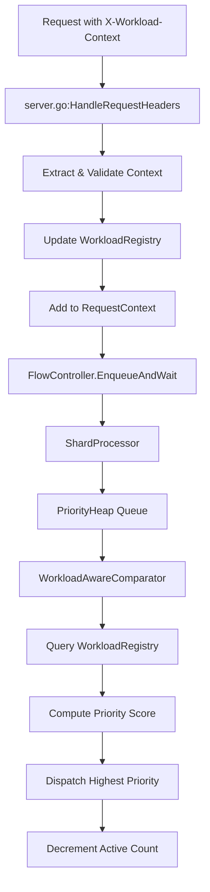

# Workload-Aware Routing Implementation & Testing Plan

## Executive Summary

This document outlines the implementation and testing strategy for adding workload-aware routing capabilities to the Gateway API Inference Extension's Endpoint Picker (EPP). The solution enables prioritization of inference requests based on workload identity, criticality, wait time, and request rate fairness.

**Key Advantage:** This implementation leverages the **existing MaxMinHeap queue** infrastructure (already in [`pkg/epp/flowcontrol/framework/plugins/queue/maxminheap.go`](pkg/epp/flowcontrol/framework/plugins/queue/maxminheap.go)), requiring minimal new code while providing full workload-aware prioritization capabilities. No new queue implementation needed!

---

## Design Overview

### 1. Workload Context Structure

**Header Name:** `X-Workload-Context`

**JSON Format:**
```json
{
  "workload_id": "string",
  "criticality": 1-5
}
```

- `workload_id`: Unique identifier for the workload (e.g., "fraud-detection", "chatbot-prod")
- `criticality`: Priority level (1=lowest, 5=highest)
- Missing/invalid context → treated as default workload with criticality=3

### 2. Workload Registry Schema

**Location:** `pkg/epp/datastore/datastore.go`

```go
type WorkloadMetrics struct {
    WorkloadID            string
    TotalRequests         int64
    ActiveRequests        int64      // In queue + being processed
    SlidingWindowRequests int64      // Requests in last 60s
    WindowStartTime       time.Time
    LastRequestTime       time.Time
    mu                    sync.RWMutex
}

type WorkloadRegistry struct {
    workloads sync.Map  // key: workload_id, value: *WorkloadMetrics
}
```

**Registry Methods:**
- `IncrementActive(workloadID)` - Called when request enters queue
- `DecrementActive(workloadID)` - Called when request completes
- `GetRequestRate(workloadID)` - Returns requests/sec in sliding window
- `GetMetrics(workloadID)` - Returns full metrics snapshot
- `Cleanup()` - Removes inactive workloads (>5min idle)

### 3. Priority Scoring Algorithm

**Formula:**
```
Priority Score = (WaitTime × 0.4) + (Criticality × 0.4) - (RequestRate × 0.2)
```

**Implementation Approach:** Lazy Heap with PriorityConfigurable Queue

```go
type WorkloadAwareComparator struct {
    workloadRegistry *WorkloadRegistry
    weights          ScoreWeights
}

func (c *WorkloadAwareComparator) Func() ItemComparatorFunc {
    return func(a, b QueueItemAccessor) bool {
        scoreA := c.computeScore(a, time.Now())
        scoreB := c.computeScore(b, time.Now())
        return scoreA > scoreB
    }
}

func (c *WorkloadAwareComparator) computeScore(item, now) float64 {
    workloadCtx := extractWorkloadContext(item)
    requestRate := c.workloadRegistry.GetRequestRate(workloadCtx.WorkloadID)
    waitTime := now.Sub(item.EnqueueTime()).Seconds()
    
    // Normalize to [0, 1]
    normalizedWait := min(waitTime / 60.0, 1.0)  // Cap at 60s
    normalizedCrit := float64(workloadCtx.Criticality) / 5.0
    normalizedRate := min(requestRate / 100.0, 1.0)  // Cap at 100 req/s
    
    return (normalizedWait * 0.4) + (normalizedCrit * 0.4) - (normalizedRate * 0.2)
}
```

### 4. Integration Architecture



**Key Integration Points:**

1. **`pkg/epp/handlers/server.go:HandleRequestHeaders()`**
   - Extract `X-Workload-Context` header
   - Parse JSON and validate
   - Store in `RequestContext.WorkloadContext`
   - Call `workloadRegistry.IncrementActive()`

2. **`pkg/epp/datastore/datastore.go`**
   - Add `workloadRegistry *WorkloadRegistry` field
   - Expose via `GetWorkloadRegistry()` method
   - Initialize in `NewDatastore()`

3. **`pkg/epp/handlers/server.go:RequestContext`**
   - Add `WorkloadContext *WorkloadContext` field

4. **New: `pkg/epp/flowcontrol/framework/plugins/intraflow/workload_aware.go`**
   - Implement `IntraFlowDispatchPolicy` interface
   - Create `WorkloadAwareComparator`
   - Register policy in plugin registry

5. **New: `pkg/epp/flowcontrol/framework/plugins/queue/heap.go`**
   - Implement `SafeQueue` with `CapabilityPriorityConfigurable`
   - Use Go's `container/heap` package
   - Support dynamic comparator

6. **`pkg/epp/flowcontrol/controller/internal/processor.go`**
   - Pass WorkloadRegistry reference to policy constructor
   - Handle cleanup on request completion

### 5. Passing WorkloadRegistry to Comparator

**Challenge:** The comparator needs access to the WorkloadRegistry to query request rates.

**Solution:** Dependency injection through policy factory

```go
// In pkg/epp/flowcontrol/framework/plugins/intraflow/workload_aware.go

type WorkloadAwarePolicyFactory struct {
    workloadRegistry *WorkloadRegistry
}

func NewWorkloadAwarePolicyFactory(registry *WorkloadRegistry) *WorkloadAwarePolicyFactory {
    return &WorkloadAwarePolicyFactory{
        workloadRegistry: registry,
    }
}

func (f *WorkloadAwarePolicyFactory) CreatePolicy() (framework.IntraFlowDispatchPolicy, error) {
    comparator := &WorkloadAwareComparator{
        workloadRegistry: f.workloadRegistry,
        weights: ScoreWeights{W1: 0.4, W2: 0.4, W3: 0.2},
    }
    
    return &WorkloadAwarePolicy{
        comparator: comparator,
    }, nil
}

// In initialization code (e.g., cmd/epp/main.go or director setup)
workloadRegistry := datastore.GetWorkloadRegistry()
policyFactory := intraflow.NewWorkloadAwarePolicyFactory(workloadRegistry)
policy, _ := policyFactory.CreatePolicy()
// Register policy with flow controller
```

**Alternative:** Pass via FlowControlRequest metadata
```go
// Store registry reference in request metadata
req.GetMetadata()["workload_registry"] = workloadRegistry

// Access in comparator
registry := item.OriginalRequest().GetMetadata()["workload_registry"].(*WorkloadRegistry)
```

**Recommended:** Use factory pattern for cleaner dependency management.

---

## Implementation Plan with Testing Steps

### **Phase 1: Design & Setup (Day 1)**

#### Step 1.1: Define Data Structures
**Files to create/modify:**
- `pkg/epp/datastore/workload_registry.go` (new)
- `pkg/epp/handlers/server.go` (modify RequestContext)

**Implementation:**
```go
// pkg/epp/datastore/workload_registry.go
type WorkloadContext struct {
    WorkloadID  string
    Criticality int
}

type WorkloadMetrics struct {
    WorkloadID            string
    TotalRequests         int64
    ActiveRequests        int64
    SlidingWindowRequests int64
    WindowStartTime       time.Time
    LastRequestTime       time.Time
    mu                    sync.RWMutex
}

type WorkloadRegistry struct {
    workloads       sync.Map
    windowDuration  time.Duration
}

func NewWorkloadRegistry() *WorkloadRegistry {
    return &WorkloadRegistry{
        windowDuration: 60 * time.Second,
    }
}

func (wr *WorkloadRegistry) IncrementActive(workloadID string) {
    // Implementation
}

func (wr *WorkloadRegistry) DecrementActive(workloadID string) {
    // Implementation
}

func (wr *WorkloadRegistry) GetRequestRate(workloadID string) float64 {
    // Implementation
}
```

**Testing:**
```bash
# Unit tests
cd pkg/epp/datastore
go test -v -run TestWorkloadRegistry

# Test cases:
# - TestIncrementActive: Verify counter increments
# - TestDecrementActive: Verify counter decrements, handles zero
# - TestGetRequestRate: Verify sliding window calculation
# - TestConcurrency: Verify thread-safety with 100 concurrent goroutines
# - TestCleanup: Verify inactive workloads removed after 5min
```

**Validation:**
- All unit tests pass
- No race conditions detected with `go test -race`
- Code coverage >80%

---

### **Phase 2: Workload Context Extraction (Day 2)**

#### Step 2.1: Header Parsing
**Files to modify:**
- `pkg/epp/handlers/server.go`
- `pkg/epp/util/request/request.go` (if exists, else create)

**Implementation:**
```go
// In HandleRequestHeaders()
func (s *StreamingServer) HandleRequestHeaders(ctx context.Context, reqCtx *RequestContext, v *extProcPb.ProcessingRequest_RequestHeaders) error {
    // Extract workload context header
    workloadContextJSON := requtil.ExtractHeaderValue(v, "x-workload-context")
    
    if workloadContextJSON != "" {
        var workloadCtx WorkloadContext
        if err := json.Unmarshal([]byte(workloadContextJSON), &workloadCtx); err != nil {
            logger.V(logutil.DEBUG).Info("Invalid workload context", "error", err)
            workloadCtx = WorkloadContext{WorkloadID: "default", Criticality: 3}
        }
        
        // Validate criticality range
        if workloadCtx.Criticality < 1 || workloadCtx.Criticality > 5 {
            workloadCtx.Criticality = 3
        }
        
        reqCtx.WorkloadContext = &workloadCtx
        
        // Update registry
        s.datastore.GetWorkloadRegistry().IncrementActive(workloadCtx.WorkloadID)
    } else {
        // Default workload
        reqCtx.WorkloadContext = &WorkloadContext{WorkloadID: "default", Criticality: 3}
    }
    
    // ... rest of existing code
}
```

**Testing:**
```bash
# Unit tests
cd pkg/epp/handlers
go test -v -run TestHandleRequestHeaders_WorkloadContext

# Test with curl
curl -X POST http://localhost:8080/v1/chat/completions \
  -H "Content-Type: application/json" \
  -H "X-Workload-Context: {\"workload_id\":\"test-workload\",\"criticality\":5}" \
  -d '{"model":"llama-2","messages":[{"role":"user","content":"Hello"}]}'

# Verify logs show:
# - Workload context extracted successfully
# - WorkloadRegistry incremented
# - Request processed with correct priority
```

**Test Cases:**
1. Valid workload context → parsed correctly
2. Missing header → defaults to "default" workload, criticality=3
3. Invalid JSON → defaults applied, logged as debug
4. Criticality out of range (0, 6) → clamped to 3
5. Empty workload_id → defaults to "default"

**Validation:**
- Check EPP logs for workload context extraction
- Verify RequestContext contains correct WorkloadContext
- Confirm WorkloadRegistry shows incremented active count

---

### **Phase 3: Workload Registry Implementation (Day 3)**

#### Step 3.1: Integrate Registry with Datastore
**Files to modify:**
- `pkg/epp/datastore/datastore.go`

**Implementation:**
```go
type datastore struct {
    // ... existing fields
    workloadRegistry *WorkloadRegistry
}

func NewDatastore(...) Datastore {
    store := &datastore{
        // ... existing initialization
        workloadRegistry: NewWorkloadRegistry(),
    }
    return store
}

func (ds *datastore) GetWorkloadRegistry() *WorkloadRegistry {
    return ds.workloadRegistry
}
```

#### Step 3.2: Update on Request Completion
**Files to modify:**
- `pkg/epp/handlers/server.go` (in defer cleanup)

**Implementation:**
```go
// In Process() defer function
defer func(error, *RequestContext) {
    // ... existing cleanup code
    
    // Decrement workload active count
    if reqCtx.WorkloadContext != nil {
        s.datastore.GetWorkloadRegistry().DecrementActive(reqCtx.WorkloadContext.WorkloadID)
    }
}(err, reqCtx)
```

**Testing:**
```bash
# Integration test
cd pkg/epp/handlers
go test -v -run TestRequestLifecycle_WorkloadMetrics

# Manual test with multiple requests
for i in {1..10}; do
  curl -X POST http://localhost:8080/v1/chat/completions \
    -H "X-Workload-Context: {\"workload_id\":\"load-test\",\"criticality\":3}" \
    -d '{"model":"llama-2","messages":[{"role":"user","content":"Test '$i'"}]}' &
done
wait

# Check metrics endpoint (if available) or logs
# Verify:
# - TotalRequests = 10
# - ActiveRequests = 0 (after all complete)
# - SlidingWindowRequests updated correctly
```

**Test Scenarios:**
1. Single request → active count increments then decrements
2. Concurrent requests → active count accurate
3. Request error → active count still decrements
4. Client disconnect → active count decrements
5. Sliding window → old requests expire after 60s

**Validation:**
- Active count never goes negative
- Total requests accumulates correctly
- Sliding window resets properly
- No memory leaks (check with pprof)

---

### **Phase 4: Flow Control Integration (Day 4-5)**

#### Step 4.1: Use Existing MaxMinHeap Queue
**Files to use:**
- `pkg/epp/flowcontrol/framework/plugins/queue/maxminheap.go` (already exists)

**Why MaxMinHeap is Perfect:**
- ✅ Already implements `framework.SafeQueue` interface
- ✅ Supports `CapabilityPriorityConfigurable`
- ✅ Accepts custom `ItemComparator` in constructor
- ✅ Thread-safe with proper locking
- ✅ O(1) PeekHead() for highest priority item
- ✅ O(log n) Add() and Remove() operations
- ✅ Already tested and production-ready

**No new implementation needed!** Just use the existing MaxMinHeap:

```go
// In policy registration or flow controller setup
comparator := &WorkloadAwareComparator{
    workloadRegistry: registry,
    weights: ScoreWeights{W1: 0.4, W2: 0.4, W3: 0.2},
}

// MaxMinHeap is already registered in the queue plugin registry
// Just reference it by name when configuring the flow
queueFactory := queue.GetQueueFactory("MaxMinHeap")
priorityQueue, _ := queueFactory(comparator)
```

**Testing:**
```bash
# The MaxMinHeap already has comprehensive tests
cd pkg/epp/flowcontrol/framework/plugins/queue
go test -v -run TestMaxMinHeap

# Verify it works with WorkloadAwareComparator:
go test -v -run TestMaxMinHeap_WithWorkloadAwareComparator
```

**Key Point:** The MaxMinHeap already does everything we need:
- Maintains heap property with custom comparator
- Comparator is called during heap operations (lazy evaluation)
- PeekHead() returns highest priority (max) item
- Fully concurrent-safe

#### Step 4.2: Implement Workload-Aware Policy
**Files to create:**
- `pkg/epp/flowcontrol/framework/plugins/intraflow/workload_aware.go`
- `pkg/epp/flowcontrol/framework/plugins/intraflow/workload_aware_test.go`

**Implementation:**
```go
type WorkloadAwarePolicy struct {
    comparator *WorkloadAwareComparator
}

func (p *WorkloadAwarePolicy) SelectItem(queue framework.FlowQueueAccessor) (types.QueueItemAccessor, error) {
    return queue.PeekHead(), nil
}

func (p *WorkloadAwarePolicy) Comparator() framework.ItemComparator {
    return p.comparator
}

type WorkloadAwareComparator struct {
    workloadRegistry *WorkloadRegistry
    weights          ScoreWeights
}

func (c *WorkloadAwareComparator) Func() framework.ItemComparatorFunc {
    return func(a, b types.QueueItemAccessor) bool {
        scoreA := c.computeScore(a, time.Now())
        scoreB := c.computeScore(b, time.Now())
        return scoreA > scoreB
    }
}

func (c *WorkloadAwareComparator) computeScore(item types.QueueItemAccessor, now time.Time) float64 {
    // Extract workload context from metadata
    metadata := item.OriginalRequest().GetMetadata()
    workloadID, _ := metadata["workload_id"].(string)
    criticality, _ := metadata["criticality"].(int)
    
    // Get request rate from registry
    requestRate := c.workloadRegistry.GetRequestRate(workloadID)
    
    // Compute wait time
    waitTime := now.Sub(item.EnqueueTime()).Seconds()
    
    // Normalize
    normalizedWait := math.Min(waitTime/60.0, 1.0)
    normalizedCrit := float64(criticality) / 5.0
    normalizedRate := math.Min(requestRate/100.0, 1.0)
    
    // Compute score
    return (normalizedWait * c.weights.W1) + 
           (normalizedCrit * c.weights.W2) - 
           (normalizedRate * c.weights.W3)
}
```

**Testing:**
```bash
cd pkg/epp/flowcontrol/framework/plugins/intraflow
go test -v -run TestWorkloadAwarePolicy

# Test cases:
# - TestScoreComputation: Verify formula correctness
# - TestPriorityOrdering: High criticality > low criticality
# - TestWaitTimeBoost: Older requests get priority boost
# - TestRequestRatePenalty: High-rate workloads penalized
# - TestEdgeCases: Zero wait time, missing metadata, etc.
```

#### Step 4.3: Wire Up Policy in FlowController
**Files to modify:**
- Flow controller initialization code
- Policy registration

**Testing:**
```bash
# Integration test with mock requests
cd pkg/epp/flowcontrol
go test -v -run TestFlowController_WorkloadAware

# Create test scenario:
# 1. Enqueue 5 requests: workload A (crit=1), B (crit=5), C (crit=3)
# 2. Verify dispatch order: B, C, A
# 3. Add high-rate workload D (crit=5, 100 req/s)
# 4. Verify D gets lower priority than B despite same criticality
```

**Validation:**
- Requests dispatched in correct priority order
- Score computation uses live data from registry
- No performance degradation (benchmark)

---

### **Phase 5: End-to-End Testing (Day 6)**

#### Step 5.1: Manual Testing with Real Requests

**Test Scenario 1: Basic Priority**
```bash
# Terminal 1: Start EPP
./epp --config config.yaml

# Terminal 2: Send low-priority request
curl -X POST http://localhost:8080/v1/chat/completions \
  -H "X-Workload-Context: {\"workload_id\":\"low-priority\",\"criticality\":1}" \
  -d '{"model":"llama-2","messages":[{"role":"user","content":"Low priority task"}]}'

# Terminal 3: Send high-priority request (should jump queue)
curl -X POST http://localhost:8080/v1/chat/completions \
  -H "X-Workload-Context: {\"workload_id\":\"high-priority\",\"criticality\":5}" \
  -d '{"model":"llama-2","messages":[{"role":"user","content":"High priority task"}]}'

# Verify: High-priority request completes first
```

**Test Scenario 2: Wait Time Boost**
```bash
# Send request and let it wait
curl -X POST http://localhost:8080/v1/chat/completions \
  -H "X-Workload-Context: {\"workload_id\":\"waiting\",\"criticality\":2}" \
  -d '{"model":"llama-2","messages":[{"role":"user","content":"Waiting request"}]}' &

# Wait 30 seconds
sleep 30

# Send newer high-priority request
curl -X POST http://localhost:8080/v1/chat/completions \
  -H "X-Workload-Context: {\"workload_id\":\"new\",\"criticality\":3}" \
  -d '{"model":"llama-2","messages":[{"role":"user","content":"New request"}]}'

# Verify: Waiting request gets priority boost and may dispatch first
```

**Test Scenario 3: Request Rate Fairness**
```bash
# Flood with workload A
for i in {1..50}; do
  curl -X POST http://localhost:8080/v1/chat/completions \
    -H "X-Workload-Context: {\"workload_id\":\"flood\",\"criticality\":4}" \
    -d '{"model":"llama-2","messages":[{"role":"user","content":"Flood '$i'"}]}' &
done

# Send single request from workload B
curl -X POST http://localhost:8080/v1/chat/completions \
  -H "X-Workload-Context: {\"workload_id\":\"fair\",\"criticality\":4}" \
  -d '{"model":"llama-2","messages":[{"role":"user","content":"Fair request"}]}'

# Verify: Workload B gets fair treatment despite lower request count
```

#### Step 5.2: Observability Testing

**Check Metrics:**
```bash
# If Prometheus metrics exposed
curl http://localhost:9090/metrics | grep workload

# Expected metrics:
# - workload_active_requests{workload_id="..."}
# - workload_total_requests{workload_id="..."}
# - workload_request_rate{workload_id="..."}
```

**Check Logs:**
```bash
# Enable debug logging
./epp --config config.yaml --log-level=debug

# Verify logs show:
# - Workload context extraction
# - Priority score computation
# - Dispatch decisions
# - Registry updates
```

**Validation Checklist:**
- [ ] High-criticality requests prioritized
- [ ] Wait time provides priority boost
- [ ] High request-rate workloads fairly throttled
- [ ] Default workload handles missing headers
- [ ] No crashes or panics
- [ ] Metrics accurately reflect workload state
- [ ] Logs provide debugging visibility

---

### **Phase 6: Performance & Load Testing (Day 7)**

#### Step 6.1: Benchmark Tests

**Create benchmark:**
```go
// pkg/epp/flowcontrol/framework/plugins/intraflow/workload_aware_bench_test.go

func BenchmarkScoreComputation(b *testing.B) {
    registry := NewWorkloadRegistry()
    comparator := &WorkloadAwareComparator{
        workloadRegistry: registry,
        weights: ScoreWeights{W1: 0.4, W2: 0.4, W3: 0.2},
    }
    
    item := createMockItem()
    
    b.ResetTimer()
    for i := 0; i < b.N; i++ {
        _ = comparator.computeScore(item, time.Now())
    }
}

func BenchmarkHeapOperations(b *testing.B) {
    queue := NewPriorityHeapQueue(comparator)
    
    b.Run("Add", func(b *testing.B) {
        for i := 0; i < b.N; i++ {
            queue.Add(createMockItem())
        }
    })
    
    b.Run("PeekHead", func(b *testing.B) {
        for i := 0; i < b.N; i++ {
            _ = queue.PeekHead()
        }
    })
}
```

**Run benchmarks:**
```bash
cd pkg/epp/flowcontrol/framework/plugins/intraflow
go test -bench=. -benchmem -cpuprofile=cpu.prof -memprofile=mem.prof

# Analyze results
go tool pprof cpu.prof
go tool pprof mem.prof

# Target performance:
# - Score computation: <1µs per call
# - Heap add: <10µs per operation
# - Heap peek: <100ns per operation
```

#### Step 6.2: Load Testing

**Setup load test:**
```bash
# Install load testing tool
go install github.com/rakyll/hey@latest

# Test 1: Baseline (no workload context)
hey -n 10000 -c 100 -m POST \
  -H "Content-Type: application/json" \
  -d '{"model":"llama-2","messages":[{"role":"user","content":"Test"}]}' \
  http://localhost:8080/v1/chat/completions

# Test 2: With workload context
hey -n 10000 -c 100 -m POST \
  -H "Content-Type: application/json" \
  -H "X-Workload-Context: {\"workload_id\":\"load-test\",\"criticality\":3}" \
  -d '{"model":"llama-2","messages":[{"role":"user","content":"Test"}]}' \
  http://localhost:8080/v1/chat/completions

# Compare results:
# - Latency (p50, p95, p99)
# - Throughput (req/s)
# - Error rate
```

**Mixed workload test:**
```bash
# Create test script: mixed_workload_test.sh
#!/bin/bash

# Low priority (30%)
hey -n 3000 -c 30 -m POST \
  -H "X-Workload-Context: {\"workload_id\":\"low\",\"criticality\":1}" \
  -d '{"model":"llama-2","messages":[{"role":"user","content":"Low"}]}' \
  http://localhost:8080/v1/chat/completions &

# Medium priority (50%)
hey -n 5000 -c 50 -m POST \
  -H "X-Workload-Context: {\"workload_id\":\"medium\",\"criticality\":3}" \
  -d '{"model":"llama-2","messages":[{"role":"user","content":"Medium"}]}' \
  http://localhost:8080/v1/chat/completions &

# High priority (20%)
hey -n 2000 -c 20 -m POST \
  -H "X-Workload-Context: {\"workload_id\":\"high\",\"criticality\":5}" \
  -d '{"model":"llama-2","messages":[{"role":"user","content":"High"}]}' \
  http://localhost:8080/v1/chat/completions &

wait

# Analyze results:
# - High-priority workload should have lower p95 latency
# - Request rate fairness maintained
# - No starvation of low-priority workloads
```

#### Step 6.3: Stress Testing

**Test registry under load:**
```bash
# Concurrent workload updates
go test -v -run TestWorkloadRegistry_Stress -timeout 5m

# Test with 1000 concurrent goroutines
# Each performing 10000 operations
# Verify:
# - No race conditions
# - Accurate counters
# - No deadlocks
```

**Memory leak test:**
```bash
# Run EPP with pprof enabled
./epp --config config.yaml --pprof-addr=:6060 &

# Generate sustained load for 1 hour
hey -n 1000000 -c 100 -q 100 -m POST \
  -H "X-Workload-Context: {\"workload_id\":\"leak-test\",\"criticality\":3}" \
  -d '{"model":"llama-2","messages":[{"role":"user","content":"Test"}]}' \
  http://localhost:8080/v1/chat/completions

# Monitor memory usage
watch -n 10 'curl -s http://localhost:6060/debug/pprof/heap | go tool pprof -top -'

# Verify:
# - Memory usage stabilizes
# - No unbounded growth
# - Workload registry cleanup working
```

**Performance Targets:**
- Throughput: >90% of baseline (without workload-aware routing)
- Latency overhead: <5ms p99
- Memory overhead: <10MB for 1000 active workloads
- CPU overhead: <10% increase
- No race conditions under load
- No memory leaks over 24h run

---

## Testing Summary

### Unit Tests
- [ ] WorkloadRegistry operations
- [ ] Header parsing and validation
- [ ] Score computation logic
- [ ] Priority heap operations
- [ ] Comparator functionality

### Integration Tests
- [ ] End-to-end request flow
- [ ] Registry updates on request lifecycle
- [ ] Policy integration with FlowController
- [ ] Concurrent request handling

### Manual Tests
- [ ] Basic priority ordering
- [ ] Wait time boost
- [ ] Request rate fairness
- [ ] Default workload handling
- [ ] Error scenarios

### Performance Tests
- [ ] Benchmark score computation
- [ ] Benchmark heap operations
- [ ] Load testing (10k requests)
- [ ] Mixed workload testing
- [ ] Stress testing (1M requests)
- [ ] Memory leak testing (24h)

### Observability
- [ ] Metrics exposed correctly
- [ ] Logs provide debugging info
- [ ] Tracing integration (if applicable)

---

## Rollout Strategy

### Phase 1: Development Environment
- Deploy to dev cluster
- Run all automated tests
- Manual validation with test workloads

### Phase 2: Staging Environment
- Deploy with feature flag (disabled by default)
- Enable for synthetic test traffic
- Monitor metrics and logs
- Performance comparison with baseline

### Phase 3: Production Canary
- Enable for 1% of traffic
- Monitor for 24 hours
- Check for errors, latency impact
- Gradually increase to 10%, 50%, 100%

### Phase 4: Full Rollout
- Enable for all traffic
- Document usage for users
- Provide examples and best practices

---

## Troubleshooting Guide

### Issue: Requests not prioritized correctly
**Debug steps:**
1. Check logs for workload context extraction
2. Verify WorkloadRegistry contains correct metrics
3. Enable debug logging for score computation
4. Check if comparator is being called

### Issue: High latency overhead
**Debug steps:**
1. Profile with pprof
2. Check heap operation frequency
3. Verify score computation efficiency
4. Consider increasing candidate window (N)

### Issue: Memory leak
**Debug steps:**
1. Check WorkloadRegistry cleanup
2. Verify request completion decrements counters
3. Look for goroutine leaks
4. Check for circular references

### Issue: Starvation of low-priority workloads
**Debug steps:**
1. Adjust weight parameters (increase W1 for wait time)
2. Implement maximum wait time guarantee
3. Add fairness quota per workload
4. Monitor queue depth per priority level

---

## Future Enhancements

1. **Dynamic Weight Adjustment**
   - Learn optimal weights from historical data
   - Per-workload weight customization

2. **SLA-Based Prioritization**
   - Define SLA targets per workload
   - Prioritize based on SLA attainment

3. **Workload Quotas**
   - Set maximum concurrent requests per workload
   - Implement token bucket rate limiting

4. **Advanced Fairness**
   - Weighted fair queuing
   - Deficit round-robin scheduling

5. **Observability**
   - Grafana dashboards for workload metrics
   - Alerting on SLA violations
   - Request tracing with workload context

---

## Appendix

### Configuration Example

```yaml
# config.yaml
flowControl:
  workloadAware:
    enabled: true
    weights:
      waitTime: 0.4
      criticality: 0.4
      requestRate: 0.2
    slidingWindowDuration: 60s
    cleanupInterval: 5m
    defaultCriticality: 3
```

### API Examples

**Request with workload context:**
```bash
curl -X POST http://localhost:8080/v1/chat/completions \
  -H "Content-Type: application/json" \
  -H "X-Workload-Context: {\"workload_id\":\"fraud-detection\",\"criticality\":5}" \
  -d '{
    "model": "llama-2-70b",
    "messages": [
      {"role": "user", "content": "Analyze this transaction for fraud"}
    ]
  }'
```

**Query workload metrics (if exposed):**
```bash
curl http://localhost:9090/api/v1/workload/fraud-detection/metrics
```

### References

- [Flow Control README](pkg/epp/flowcontrol/README.md)
- [EPP Architecture Proposal](docs/proposals/0683-epp-architecture-proposal)
- [Gateway API Inference Extension Docs](https://gateway-api-inference-extension.sigs.k8s.io/)

---

**Document Version:** 1.0  
**Last Updated:** 2026-01-22  

---

## Phase 5 Completion Summary

### Configuration Fixed (2026-01-26)

**Changes Made:**

1. **test/testdata/inferencepool-e2e.yaml:107-123**
   - Removed invalid `flowControl:` section
   - Added `workload-aware-ordering-policy` plugin
   - Enabled `flowControl` feature gate

2. **pkg/epp/flowcontrol/registry/config.go:41**
   - Changed `defaultOrderingPolicyRef` from `FCFSOrderingPolicyType` to `WorkloadAwareOrderingPolicyType`

3. **pkg/epp/flowcontrol/registry/config.go:46**
   - Changed `defaultQueue` from `queue.ListQueueName` to `queue.MaxMinHeapName`

**Why MaxMinHeap:**
- WorkloadAwarePolicy requires `CapabilityPriorityConfigurable`
- ListQueue only provides FIFO capability
- MaxMinHeap provides priority queue with custom comparators

**Test Command:**
```bash
make image-build
make test-e2e
```

**Test Request:**
```bash
curl -X POST http://localhost:8080/v1/chat/completions \
  -H "X-Workload-Context: {\"workload_id\":\"test\",\"criticality\":5}" \
  -d '{"model":"llama-2","messages":[{"role":"user","content":"Test"}]}'
```

**Status:** Configuration complete, ready for testing
**Author:** IBM Bob (AI Planning Assistant)